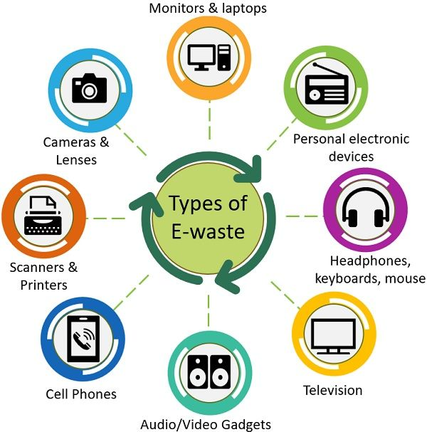
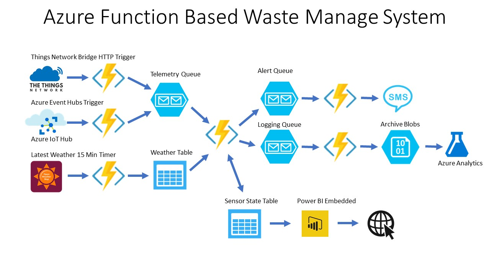

# Smart India Hackathon Workshop
# Date : 16/05/2006
## Register Number : 212223110047
## Name : Shaik Samreen
## Problem Title
E-Waste Facility Locator
## Problem Description
Website that tells you the location of the nearest e-waste collection and recycling facility. Offers educational pop-ups on the harmful components of your e-waste and their effects on the environment and human health if not disposed correctly. There could be an option to input the model of your old device and earn credit points relative to the amount of precious metals recovered from the device if disposed correctly.
## Problem Creater's Organization
Ministry of Environment

## Idea
E-waste management plays an important role in protecting :

Environment Conserving resource promoting a healthier and safer world. By reducing, reusing, and recycling electronic devices, we can make a positive impact and pave the way for a sustainable future.

## Proposed Solution / Architecture Diagram

## Use Cases
## Consumer Education and Awareness:
Use Case: A mobile application that educates consumers about e-waste management, providing information on how to properly dispose of electronic devices, where to recycle them, and the environmental impacts of improper disposal.
 ## E-Waste Collection and Recycling:

 Use Case: A community-based e-waste collection program where residents can schedule pickups for their old electronics or drop them off at designated collection points.

 ## Informal Sector Integration and Capacity Building:
 
 Use Case: A government-led initiative aimed at formalizing and integrating informal e-waste recyclers into the formal waste management sector. The program provides training on safe handling and recycling techniques, access to protective gear and equipment.

## Technology Stack

1)User Interface (Web/Mobile App): The starting point where users interact with the system.

2)Frontend (Client-side code): Handles user inputs, sends requests to the backend, and updates the UI based on responses.

3)Backend (Server-side code): Processes requests from the frontend, interacts with the database, external APIs, and other services.

4)Geolocation Service: Determines the user's current location if needed.

5)Database: Stores information about e-waste facilities.

6)External APIs: Such as mapping services for displaying facility locations and directions.

7)Data Flow: Represents the flow of data between various components, including user input, backend processing, database queries, and external services.

8)Response to User: The final output displayed to the user, including search results and facility information.

## Internet of Things (IoT) Devices:

Sensors: RFID, GPS, weight sensors

Description: Deploy IoT devices on e-waste collection bins, vehicles, and recycling facilities to track the movement of e-waste throughout the supply chain. Use RFID tags to identify and categorize items, GPS trackers for route optimization and monitoring, and weight sensors for accurate measurement of collected e-waste.

## Dependencies

Dependencies in e-waste management refer to the interconnected factors that influence the effectiveness and success of e-waste management initiatives.

Regulatory Frameworks Public Awareness and Education Industry Collaboration Infrastructure Development Technological Innovation Financial Resources International Cooperation Environmental Considerations